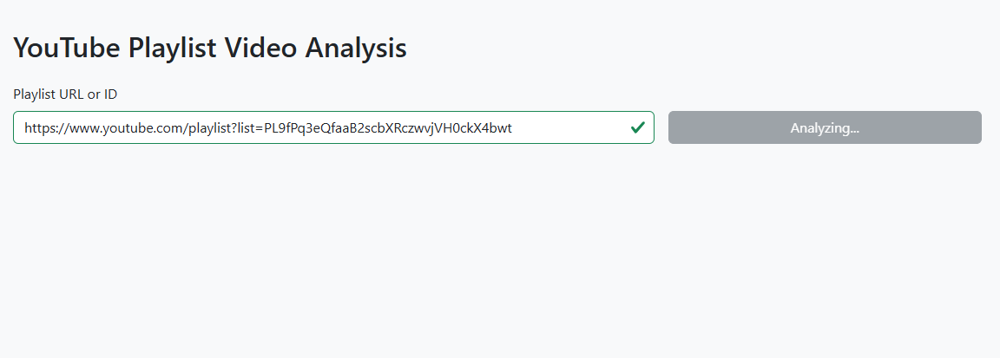
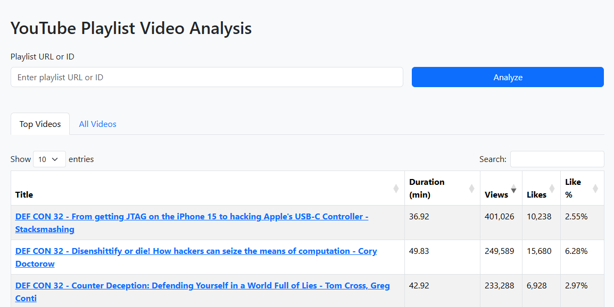

# Playleast: Youtube playlist analyzer

## Setup locally
- Install python 
- [Optional] Install virtual environment package like poetry
- [Optional] Create a virtual environment
- Install the Dependencies: `google-api-python-client google-auth-oauthlib google-auth-httplib2 pandas isodate fastapi uvicorn jinja2 python-multipart sqlalchemy requests python-dotenv`

## Google Cloud Console
- Go to: https://console.cloud.google.com/

- Enable the YouTube Data API v3 for your project

- Go to "APIs & Services" > "Credentials" > "Create Credentials" > "OAuth client ID" >  "Desktop app"

- Download the JSON file & Place it as client_secret.json in the same directory as the py file

- Add Test user which will be used in the OAuth Consent Screen here: https://console.cloud.google.com/auth/audience

## Run it
`uvicorn main:app --reload`

## Usage

## Todo:
- add loader